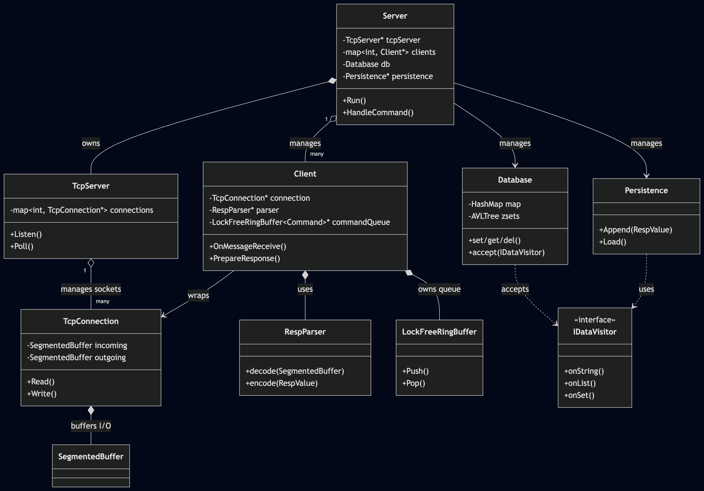

# Redis from Scratch in C++

A high-performance, multi-threaded Redis server implementation in C++ focusing on efficiency, modern C++ patterns, and standard Redis compatibility through the RESP3 protocol.

## 🚀 Features

- **RESP3 Protocol Suite**: Full support for encoding and decoding Redis Serialization Protocol (RESP3) data types:
  - Simple Strings & Errors
  - Integers & Big Numbers
  - Bulk Strings
  - Arrays & Sets
  - Maps (Key-Value pairs)
  - Booleans
- **Enhanced Zero-Copy Architecture**: Utilizes `std::string_view` for parsing incoming network buffers and database lookups. Complements this with `SegmentedBuffer` for direct socket reads and a zero-copy persistence path that writes `RespValue` directly to disk without intermediate string conversions.
- **AOF Persistence**: Full Append Only File support with configurable flush intervals. Implements a background rewriting mechanism (`BGREWRITEAOF`) using a child process to compact the log without blocking command execution.
- **RDB Snapshotting**: Custom, highly-compact binary serialization for point-in-time database snapshots (`SAVE`). Implements Linux `fork()` COW semantics to save snapshots asynchronously in the background (`BGSAVE`) without interrupting the main event loop.
- **Pub/Sub Messaging**: Complete publish/subscribe implementation supporting `PUBLISH`, `SUBSCRIBE`, and `UNSUBSCRIBE`. Architected purely utilizing lock-free concurrent queues across the networking and server worker threads to guarantee zero mutex contention.
- **Visitor Pattern Traversal**: Decoupled database traversal logic using the Visitor pattern, enabling flexible state inspection for AOF rewrites and secondary integrations.
- **Memory Optimized**: Employs `std::variant` for the core `RespValue` structure, significantly reducing the memory overhead of represented data types through overlapping memory storage.
- **Multi-threaded I/O**: Custom TCP networking stack supporting `poll`-based event loops and asynchronous response queuing.
- **Thread Safety**: Implements a lock-free Producer-Consumer pattern using `LockFreeRingBuffer` and self-piping for efficient cross-thread communication without mutex contention on the hot path.

- **Supported Data Structures**:
  - **Strings**: `GET`, `SET` (with EX/PX), `DEL`, `TTL`, `EXPIRE`, `INCR`, `DECR`, etc.
  - **Lists**: `LPUSH`, `RPUSH`, `LPOP`, `RPOP`, `LLEN`, `LRANGE`.
  - **Hashes**: `HSET`, `HGET`, `HDEL`, `HLEN`, `HGETALL`, `HMSET`, `HMGET`.
  - **Sets**: `SADD`, `SREM`, `SISMEMBER`, `SMEMBERS`, `SCARD`.
  - **Sorted Sets**: `ZADD`, `ZREM`, `ZSCORE`, `ZRANK`, `ZRANGE`, `ZRANGEBYSCORE`, `ZCARD`.
  - **Pub/Sub**: `PUBLISH`, `SUBSCRIBE`, `UNSUBSCRIBE`.
  - **System**: `PING`, `ECHO`, `CONFIG`, `FLUSHALL`, `BGREWRITEAOF`, `SAVE`, `BGSAVE`.

## 🛠 Architecture



The project is divided into several clear components:

- `lib/`: Core library containing networking (`TcpServer`, `TcpConnection`), the RESP parser (`RespParser`), threading utilities (`LockFreeRingBuffer`), and the Persistence engine.
- `lib/common/`: Shared utilities including `SegmentedBuffer`, `ProcessUtil` (for fork management), and intrusive data structure helpers.
- `server/`: The main server logic, implementing a Producer-Consumer architecture. The Network Thread produces commands into a lock-free queue, which the Server Thread consumes. Responses are queued back to the Network Thread for transmission, ensuring thread safety and decoupling.
- `client/`: A test client utility for verifying server behavior and protocol compliance.

For a detailed deep-dive into the system design, please refer to the [Architecture Report](doc/report.pdf).

## 🏗 Building the Project

The project uses CMake for building. Ensure you have a C++17 compliant compiler installed.

```bash
mkdir -p build
cd build
cmake ..
make -j$(sysctl -n hw.ncpu)
```

## 🚦 Getting Started

### Running the Server
```bash
./build/server/redis_server
```
The server will start listening on the default Redis port (6379), load its AOF state, and begin accepting connections.

### Persistence Configuration
The server supports configurable persistence through the standard `CONFIG` command:
```bash
redis-cli CONFIG SET appendfsync-interval 5  # Flush to disk every 5 seconds
redis-cli BGREWRITEAOF                      # Trigger background compaction
```

## 🚥 Testing

The project includes a suite of unit and integration tests.

### C++ Unit Tests
```bash
# Run all core tests
./build/test/test_ringbuffer
./build/test/test_hashmap
./build/test/test_avltree
./build/test/test_database
./build/test/test_resp_parser
./build/test/test_segmented_buffer
./build/test/test_network
```

### Python Integration Tests
The integration suite utilizes `pytest` and `redis-py` to spawn the server automatically and validate end-to-end command execution, persistence durability across restarts, and concurrent Pub/Sub mechanics:
```bash
python3 -m venv venv
source venv/bin/activate
pip install -r test/integration/requirements.txt
pytest test/integration/ -v
```

## 📝 Future Roadmap

- [x] Persistence (AOF with Background Rewrite).
- [x] RDB Binary Export.
- [x] Pub/Sub support.
- [ ] Advanced commands (`BRPOP`, `HINCRBY`, `MGET`, etc.).

## 📚 Acknowledgments

This project was developed with the help of the excellent guide [Build Your Own Redis](https://build-your-own.org/redis/) by James Smith. Many of the architectural decisions and data structure implementations (like the intrusive hash map and AVL tree) were inspired by his approach.

## 📜 License
This project is for educational purposes as a deep dive into systems programming and networking.
